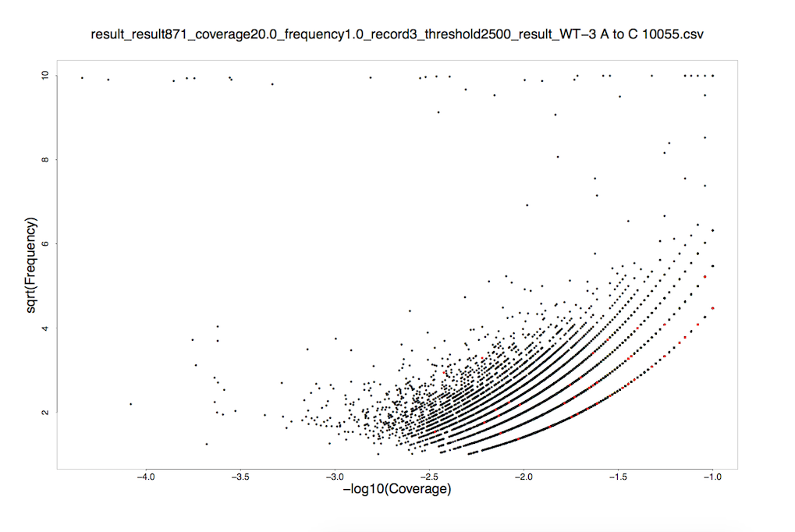

# biotools.plot
 python process source data,R plot it

## Process

> support batch

* get custom column data from csv files

## Plot

> support batch

* plot()

## How to write R script

* [Manuals](https://cran.r-project.org/manuals.html)

# Screen shot

